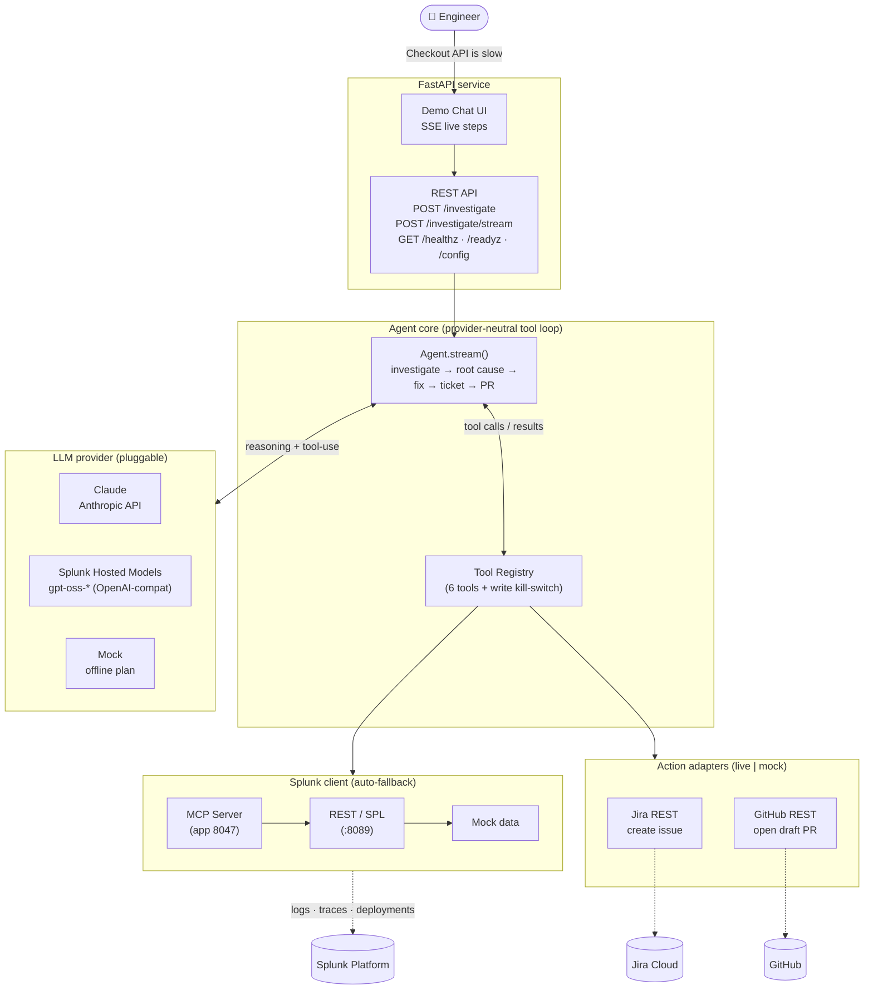
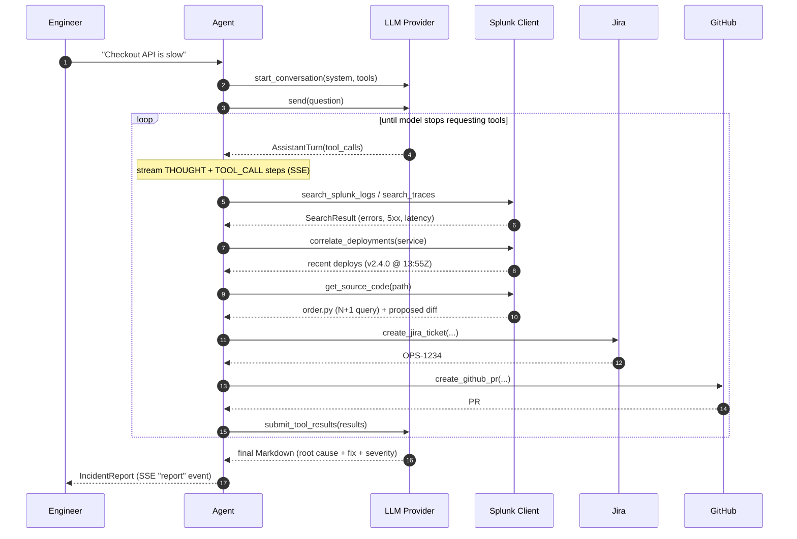
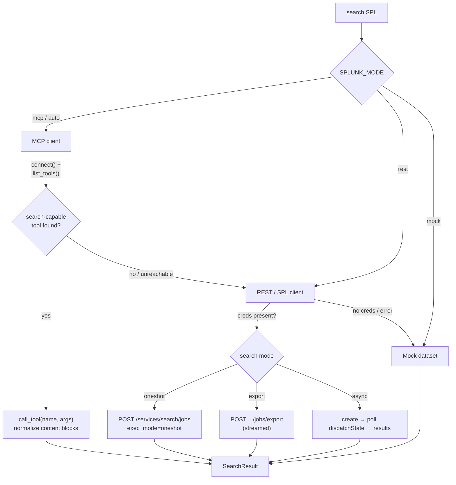
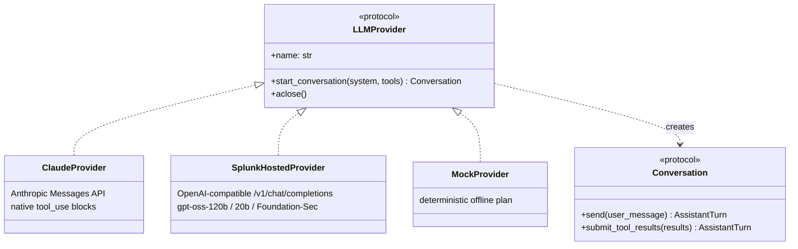

# DevOpsGPT — Architecture

DevOpsGPT is an **autonomous incident-investigation agent** that turns a plain-English
problem report into a root-cause analysis, a code fix, a Jira ticket, and a draft GitHub PR
— grounded in **Splunk** operational data and driven by a **pluggable LLM** through a
provider-neutral tool-calling loop.

This document covers the three things the hackathon requires:
1. **How the app interacts with Splunk** (MCP primary → REST fallback → mock).
2. **How AI models/agents are integrated** (provider abstraction + agent loop).
3. **Data flow** between services, APIs, and components.

---

## 1. System overview

---

## 2. The investigation loop (data flow)

The agent runs a **provider-neutral tool-calling loop**. The same control flow drives Claude,
Splunk Hosted Models, or the offline mock — each provider only adapts the normalized
`ToolSpec` / `ToolCall` / `ToolResult` types to its native wire format.

**Key:** the agent decides *which* tools to call and *when to stop* — it is not a fixed
script. The mock provider simulates a sensible plan so the loop is fully demonstrable offline.

---

## 3. Splunk interaction — capability discovery & graceful fallback

The Splunk client is the most resilient part of the system, by design (the exact Splunk MCP
Server tool names and deployment topology vary per environment).

**Design properties:**

- **Capability discovery, not hardcoding.** The MCP client calls `list_tools()` and maps the
  server's *real* tools to capabilities (search / deployments) by name+description hints, so
  it survives whatever Splunk MCP Server (app 8047) actually exposes. Resolved tools are
  logged once at startup.
- **One configurable auth builder** (`bearer` / `splunk` / `basic`) — `Authorization` header
  style is a single config switch (`SPLUNK_AUTH_SCHEME`), not branched throughout the code.
- **Never raises on empty/failed search** — errors surface as `SearchResult.error` so the
  agent reasons about partial failure instead of crashing.
- **`auto` mode** probes MCP → REST → mock on first use and caches the first healthy backend.

---

## 4. AI integration — provider abstraction

The agent depends only on the `LLMProvider` / `Conversation` protocols and the normalized
tool types (`ToolSpec`, `ToolCall`, `ToolResult`, `AssistantTurn`). Swapping the brain is a
single env var (`DEVOPSGPT_LLM_PROVIDER`), and a failed provider init degrades to mock rather
than crashing startup.

---

## 5. Component / module map

| Layer | Module | Responsibility |
| --- | --- | --- |
| **API** | `api/app.py`, `api/index.html` | FastAPI app, SSE streaming, health, demo UI |
| **Agent** | `agent.py`, `prompts.py` | The tool-calling investigation loop + report synthesis |
| **Tools** | `tools.py` | Bridges LLM tool calls ↔ Splunk/Jira/GitHub; write kill-switch |
| **LLM** | `llm/{base,claude,hosted,mock,factory}.py` | Provider abstraction |
| **Splunk** | `splunk/{base,mcp_client,rest_client,mock_client,factory,auth}.py` | Search backends + auto-fallback |
| **Actions** | `integrations/{jira,github}.py` | Live + mock ticket/PR adapters |
| **Core** | `config.py`, `models.py`, `logging.py`, `service.py` | Settings, domain models, structured logs, DI assembly |
| **Entry** | `cli.py` | `devopsgpt serve` / `investigate` |

---

## 6. Resilience & safety summary

| Concern | Mechanism |
| --- | --- |
| Unconfigured environment | Boots fully mocked (Splunk + LLM + Jira + GitHub); never hard-fails |
| Flaky Splunk MCP server | Auto-falls back to REST, then mock |
| Missing live creds with `*_MODE=live` | Adapter degrades to mock + logs a warning |
| Runaway agent | `max_agent_iterations` + `agent_timeout_s` bounds |
| Accidental writes during a demo | `DEVOPSGPT_ALLOW_WRITE_ACTIONS=false` plans actions without executing |
| Per-request state leakage | Fresh tool registry + agent per investigation; clients shared |
| Secret leakage | `/config` exposes only non-secret effective settings |
